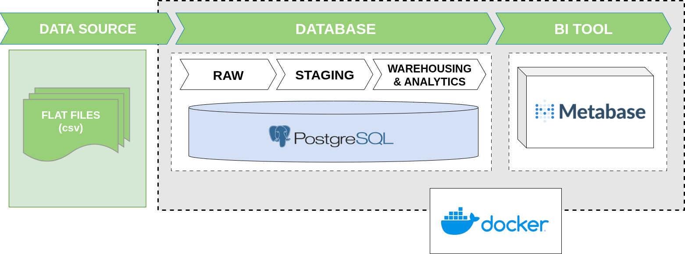

# Olist E-Commerce Data Warehouse

This project is an end-to-end ELT data pipeline built on the popular Brazilian E-Commerce Public Dataset by Olist. It transforms raw CSV data into a robust analytical data warehouse to power interactive business intelligence dashboards.


Building this project was a fantastic opportunity to take the SQL theories I learned at university and put them straight into real-world action. To keep the entire system as lightweight as possible without heavy external compute engines, I decided to maximize PostgreSQL—the exact database I was taught at school. Using just Postgres and simple orchestration, I designed a complete ELT pipeline that smoothly processes data into a clean Star Schema Warehouse.

This hands-on journey allowed me to dive deep into:
* **SQL Practice:**  build a proper data pipeline from Raw to Staging, and ultimately into utilizing Facts and Dimensions to create a dashboard.
* **Database Optimization:** Leveraged advanced PostgreSQL features like CTEs, Upserts, and Logical Views to clean data, handle duplicate records.
* **Linux & Bash Orchestration:** Challenged myself to write custom Bash scripts (actually i vibe code it with detail instructions) to automate everything from database initialization to data quality testing, which was the perfect playground to get comfortable with the command line.
## Architecture & Tech Stack


*(Note: Architecture diagram)*


## How to Run

**1. Setup Environment Variables**
Copy the example environment file from the parent repository into this project folder and rename it to `.env`:
```bash
cp ../.env_example .env

```

*(Ensure you are in the `dbms_classic_studies` root, or manually copy `.env_example` into the `Brazilian E-Commerce Public Dataset by Olist` folder as `.env`)*

**2. Start the Docker Containers**
Navigate to the project directory and spin up PostgreSQL and Metabase:

```bash
cd "Brazilian E-Commerce Public Dataset by Olist"
docker compose up -d

```

**3. Execute the Data Pipeline**
Grant execution permissions to the bash scripts, then run the initialization and the full ELT pipeline:

```bash
# Make scripts executable
chmod +x scripts/*.sh

# Initialize schemas and tables
./scripts/reset_db.sh

# Run the complete ELT pipeline (Raw -> Staging -> Warehouse -> Analytics -> Tests)
./scripts/run_pipeline.sh

```

**4. View Dashboards**
Once the pipeline outputs `FULL PIPELINE SUCCESS`, open your browser and navigate to `http://localhost:3000` to access Metabase and explore the analytical views.

```
